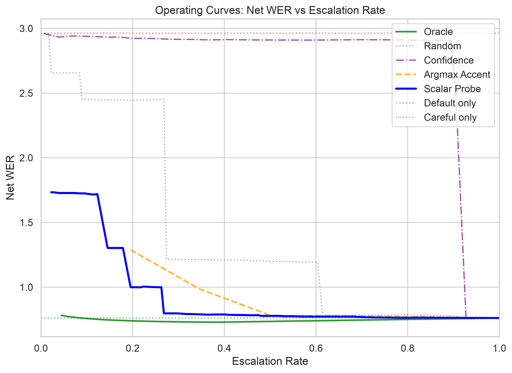

# Accentedness-Scalar Routing for English ASR

Route English ASR utterances between a fast default recognizer (Whisper-small) and a careful one (Whisper-large-v3) using a learned difficulty scalar derived from WavLM-large features.

## Key Result

The scalar probe outperforms the argmax-accent baseline at practical escalation budgets (WER 1.00 vs 1.28 at 20% escalation, 0.80 vs 1.08 at 30%), though the two converge at higher budgets.



| Trigger | WER @20% | WER @30% | Area vs Random |
|---------|----------|----------|----------------|
| Oracle | 0.74 | 0.73 | 0.65 |
| **Scalar probe** | **1.00** | **0.80** | **0.45** |
| Argmax accent | 1.28 | 1.08 | 0.45 |
| Random | 2.44 | 1.21 | 0.00 |
| Confidence | 2.92 | 2.92 | -1.33 |

Whisper's internal confidence (avg_logprob) is worse than random for routing accented speech — a notable negative finding.

## Quick Start

```bash
# Install dependencies (requires uv)
make setup

# Run smoke tests (verifies WavLM, mlx-whisper, jiwer)
make smoke

# Full reproduction (data -> ASR -> features -> baselines -> probe -> eval -> report)
make reproduce
```

Individual pipeline steps can be run separately — see [Pipeline Steps](#pipeline-steps) below.

## Project Structure

```
configs/          - YAML configurations
scripts/          - Runnable pipeline scripts
src/accentedness_routing/
  data/           - EdAcc loading & speaker-disjoint splits
  asr/            - mlx-whisper transcription & WER
  features/       - WavLM feature extraction
  triggers/       - Routing score producers (oracle, random, confidence, probe)
  routing/        - Threshold sweep & operating curves
  eval/           - Evaluation, slicing, plots
  flywheel/       - Drift detection & hard-case mining
tests/            - Unit & integration tests
experiments/      - Experiment reports & figures
writeup/          - Final deliverable
docs/             - Research notes & knowledge base
```

## Pipeline Steps

| Step | Command | Description |
|------|---------|-------------|
| 1 | `make data` | Load EdAcc, select 6 accents x 150 utterances, create speaker-disjoint splits |
| 2 | `make asr` | Transcribe with Whisper-small and Whisper-large-v3, compute per-utterance WER |
| 3 | `make features` | Extract WavLM-large hidden states (25 layers x 1024 dims per utterance) |
| 4 | `make baselines` | Compute oracle, random, confidence, and argmax-accent operating curves |
| 5 | `make probe` | Train the accentedness scalar probe on speaker-held-out train fold |
| 6 | `make eval` | Generate operating curves, per-accent analysis, speaker leakage check |
| 7 | `make report` | Produce experiment report with figures and summary metrics |
| 8 | `make flywheel` | (Optional) Drift detection and hard-case mining |

All steps cache their outputs. Re-running a step after completion returns instantly.

## Dataset

[EdAcc](https://huggingface.co/datasets/edinburghcstr/edacc) (Edinburgh Accented English), 6 accents selected to span the WER difficulty spectrum:

| Accent | Default WER | Careful WER | Escalation Gain |
|--------|-------------|-------------|-----------------|
| Indian English | 8.96 | 0.40 | 8.56 |
| US English | 5.14 | 3.13 | 2.01 |
| Southern British | 1.67 | 0.35 | 1.32 |
| Scottish English | 0.33 | 0.26 | 0.07 |
| Irish English | 0.31 | 0.29 | 0.02 |
| Nigerian English | 0.40 | 0.39 | 0.01 |

Splits are speaker-disjoint (no speaker appears in more than one fold): 544 train / 177 val / 179 test utterances across 49 speakers.

## Probe Architecture

```
WavLM-large (25 layers x 1024) -> mean-pool per layer
  -> LearnableWeightedSum(25) -> Linear(1024, 256) -> ReLU -> Dropout(0.1) -> Linear(256, 1)
```

- ~263K trainable parameters
- Target: per-utterance WER from Whisper-small
- Loss: HuberLoss(delta=0.1)
- Early stopping on validation loss (patience=10)
- Score calibration: percentile normalization from training set

## Requirements

- Python 3.10-3.12
- Apple Silicon Mac (for mlx-whisper)
- ffmpeg
- ~24 GB RAM recommended
- [uv](https://docs.astral.sh/uv/) package manager

## Tests

```bash
make test       # Run all tests (smoke + synthetic E2E)
make smoke      # Smoke tests only (WavLM, mlx-whisper, jiwer)
```
